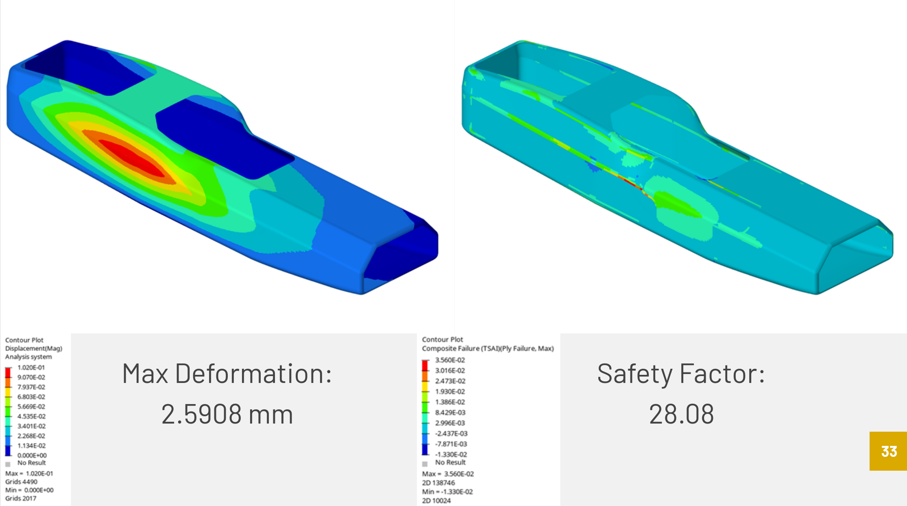

# Altair Hypermesh FEA

<figure><figcaption></figcaption></figure>


[Slideshow guide](https://docs.google.com/presentation/d/1UXROaVFQWAnqdjul2bFxvcXntUodfhMfZ_6AoO2F8Fg/edit?usp=sharing)


#### Reasons to Use Altair Hypermesh

Altair's ply-based modeling more intuitively depicts how the final layup will be stacked than zone-based models. Hypermesh also has strong integration with Siemens NX, our club's (and Purdue's) CAD software of choice.

#### Prepping Your Model and System

Before you begin FEA, you must make sure your model is properly imported into Hypermesh and is of acceptable quality (but not needlessly high). Ensure element normals are correctly oriented and [material (MAT)](altair-hypermesh-mat-cards.md) cards are entered/imported.

#### Creating Properties, Sets, and Plies

The next step is to create and apply a property with the wanted card image and Z-offset. Create sets of elements (typical zone-based approach) and plies as needed.

#### FEA Setup

To begin Altair Hypermesh FEA, create [load and constraint](altair-hypermesh-load-cards.md) collectors as well as [Load Step](https://2021.help.altair.com/2021.2/hwdesktop/hm/topics/pre_processing/entities/load_steps_r.htm?zoom_highlight=subcase) cards for each analysis.

* Load Collector - Force ([FORCE](https://2021.help.altair.com/2021.2/hwsolvers/os/topics/solvers/os/force_bulk_r.htm)) and/or pressure ([PLOAD](https://2021.help.altair.com/2021.2/hwsolvers/os/topics/solvers/os/pload_bulk_r.htm)) cards applied to the model for analysis.
* Constraint Collector - Fixed point ([SPC](https://2021.help.altair.com/2021.2/hwsolvers/os/topics/solvers/os/spc_bulk_r.htm)), fixed set ([SPC1](https://2021.help.altair.com/2021.2/hwsolvers/os/topics/solvers/os/spc1_bulk_r.htm)), or inertial relief ([PARAM, INREL](https://2021.help.altair.com/2021.2/hwsolvers/os/topics/solvers/os/param_inrel_bulk_r.htm#param_inrel_bulk_r)) cards to constrain model displacement.
* Load Step ([SUBCASE](https://2021.help.altair.com/2021.2/hwsolvers/os/topics/solvers/os/subcase_specific_modeling_r.htm?zoom_highlight=subcase)) - Selects which collectors to use and general settings. Multiple can be made for each solver run.


In the SUBCASE link scroll to your solver section


#### FEA Analysis

Once the solver has finished, opened the finished .fem file in Altair Hyperviewer to see contour plots of stress, strain, Tsai Wu, etc.
