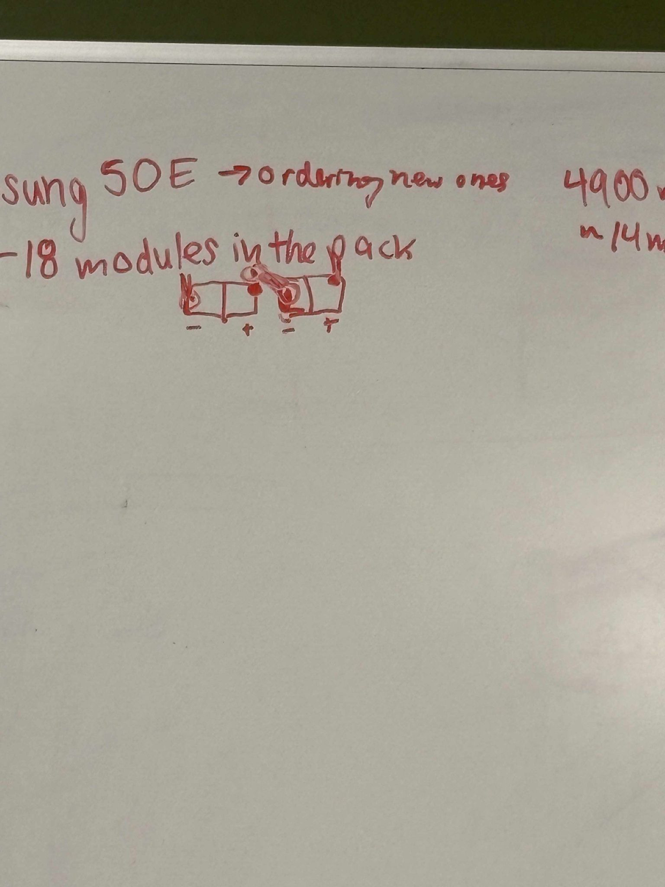
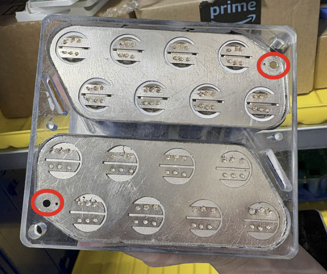

# Battery Configuration

Constraint: 5.25 kWh storage cap 18650 battery store - Samsung INR21700-50E

Cell nominal voltage: 3.63V&#x20;

1C = 4.9Ah

\=> In Wh = 17.8 Wh/cell

Average resistance: 14mOhm/cell

Old design: 29s10p

* For series: (3.7\*29) = 107.3V
* For parallel: 4.9 \* 10 = 49 Ah
* Pack power/capacity = 107.3 \* 49 = 5.258 kWh
* Total num of cells: 290 cells

Current design: 36s8p for the whole pack. 2s8p per module&#x20;

* For series: (3.7 \* 36)  = 133.2 V
* For parallel: 4.9 \* 8 = 39.2 Ah
* Total resistance per module: 2 strings of 8 parallels: Rtotal = 2\*(14mOhm/8) = 3.5 mOhm
* Pack power/capacity = 133.2 \* 39.2 = 5.221 kWh
* Total num of cells = 36\*8 = 288 cells

⇒ Internal loss (assuming all internal resistance is maintained:&#x20;

* Ploss(old) = I^2\*R = 49^2 Ah/R
* Ploss(new) = I^2\*R = 39.2^2 Ah/R
* Reduces loss by: (39.2^2-49^2)/49^2 = 36%

Criteria for modules going on the pack:

* Resistance of < 0.2 mOhms difference per module

Battery hardware:&#x20;

 

* Radlocks RL9036-101 radloks - M4 (get M4 nuts)
* Nickel cutting - Nickel 201 0.5mm thick
* Spotweld settings: 6V
* 33ms for battery pack
* 6ms for wires (smaller stuff)

