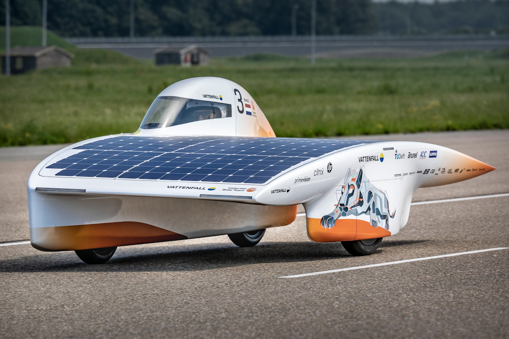
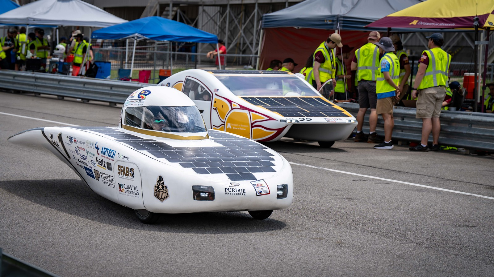

# Array Design

Creating a viable, reliable, and strong solar array requires clear communication with composites/aero to ensure that each of your requirements are met. Composites will likely take more of a priority on some design choices, but there are a few that should be pushed for heavily.

### Design Constraints

Array design can be a bit of a challenge and time crunch because it heavily relies on the design of the car and top shell being finalized. There are a few constraints that you can push for during car design phase.

* As of now (Nov. 2024) there are 3 main car designs that teams use: Three-wheel asymmetric catamaran, Four-wheel asymmetric catamaran, and Three-wheel bullet.

<figure><figcaption>
Three-Wheel Asymmetric Catamaran
</figcaption></figure>

<figure><figcaption>
Four-Wheel Asymmetric Catamaran
</figcaption></figure>

<figure><figcaption>
Three-Wheel Bullet (Our 2024 Car)
</figcaption></figure>

* Based on the three main designs, **the ideal setup for solar is either the three or four-wheel asymmetric catamaran**. It has a wide top shell, which limits the variety of sizes of your sub arrays. They can be made with many of the same size sub-array, reducing risk and difficulty when manufacturing.
* Bullet is do-able, you just have to take care with the size of sub-arrays, try to make them mostly the same size.
  * We had an issue like this for Lux, we made large arrays, and they were highly prone to breaking during the manufacturing phase. Lesson learned MAKE 'EM SMALL AND MODULAR.
* **IMPORTANT:** Be on the case of whoever is designing the top shell to ensure that the shell is never bending in multiple directions at any point. This contour will result in extreme difficulty with integrating the finished product on the car and will likely end with cracked/broken sub-arrays.
* Our previous ASC 2024 car, Lux, was a three-wheel bullet, so for simplicity and familiarity we are going with that same design for ASC 2025

