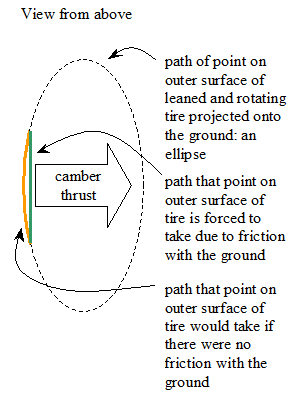
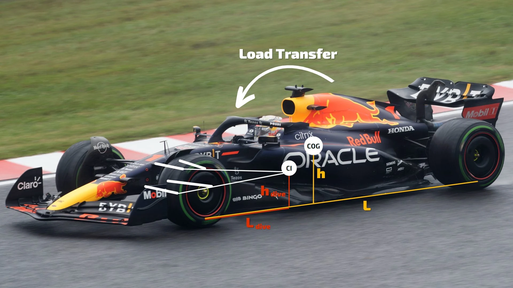

# Introduction and Resources

## Nomenclature, Important Geometries, and Visualization

Let's start with some terminology and definitions ([#glossary](introduction-and-resources.md#glossary "mention")). I recommend coming back to this section often to remember certain definitions. New terms or definitions are highlighted in <mark style="color:green;">green</mark> or <mark style="color:yellow;">yellow</mark> or <mark style="color:blue;">blue</mark>, with the <mark style="color:yellow;">yellow</mark> terms being an alternative name and the <mark style="color:blue;">blue</mark> terms being a new definition not directly listed in the glossary. Some hard-to-visualize definitions mention a <mark style="color:purple;">video</mark> to reference.

### Glossary 

<mark style="color:green;">**Camber**</mark>: From a front view, camber is the angle of a wheel relative to vertical. <mark style="color:green;">Positive camber</mark> means the top of the wheel is tilted away from the car.

<figure><figcaption>
Camber
</figcaption></figure>

<mark style="color:green;">**Kingpin Axis**</mark>  ( or <mark style="color:yellow;">**Steering Axis**</mark>): The axis that is created by drawing a straight line joining the outboard upper and lower ball joints is called the kingpin axis or the steering axis. The wheel assembly rotates about this axis when steering

<figure><figcaption>
Kingpin Axis for double wishbone (left), MacPherson strut (right)
</figcaption></figure>

<mark style="color:green;">**Kingpin Inclination**</mark> (<mark style="color:green;">**KPI**</mark>) / <mark style="color:yellow;">**Steering Axis Inclination**</mark>: From a front view (or a rear view), KPI is the angle of the kingpin axis relative to vertical. A <mark style="color:green;">positive KPI</mark> means the upper ball joint is closer to the chassis (more inboard).

<mark style="color:green;">**Scrub Radius**</mark>: From a front view, scrub radius is the horizontal distance from the center of the tire contact patch to the point where the kingpin axis intersects the ground. A <mark style="color:green;">positive scrub radius</mark> means the intersection point of the kingpin axis with the ground is more inboard than the center of the tire contact patch.

<figure><figcaption>
Positive KPI and positive scrub radius
</figcaption></figure>

<mark style="color:green;">**Wheel Center Offset**</mark>: From a front view, wheel center offset is the horizontal distance from the center of the wheel to the kingpin axis. This parameter is often constrained as a minimum value for packaging reasons.

<figure><figcaption>
Wheel Center Offset
</figcaption></figure>

<mark style="color:green;">**Caster Angle**</mark>: From a side view, caster angle is the angle of the kingpin axis relative to vertical. A <mark style="color:green;">positive caster angle</mark> means the lower ball joint is closer to the front of the car. Sometimes caster angle is referred to simply as <mark style="color:yellow;">caster</mark>.

<figure><figcaption>
Positive caster angle
</figcaption></figure>

<mark style="color:green;">**Mechanical Trail**</mark> (or <mark style="color:yellow;">**Caster Offset**</mark>): From a side view, mechanical trail (or **caster offset**) is the distance from the center of the tire contact patch to the point where the kingpin axis intersects the ground. <mark style="color:green;">Positive mechanical trail</mark> means the kingpin axis intersection with the ground leads the tire contact patch.&#x20;

<mark style="color:green;">**Caster Displacement**</mark>: From a side view, caster displacement is the horizontal distance from the center of the wheel (or the <mark style="color:blue;">axis of wheel rotation</mark>) to the kingpin axis. <mark style="color:green;">Positive caster displacement</mark> means the kingpin axis leads the center of the wheel. Negative caster displacement is sometimes called "<mark style="color:yellow;">caster trail</mark>."

<figure><figcaption>
Car is moving to the left: positive caster angle, positive mechanical trail (caster offset), and negative caster displacement (shown as caster trail in the image)
</figcaption></figure>

<mark style="color:green;">**Toe Angle**</mark>: From a top view, toe is the angle of a wheel relative to straight tracking. <mark style="color:green;">Toe in</mark> means the front of the wheel is pointed in toward the chassis, and <mark style="color:green;">toe out</mark> means the front of the wheel is pointed out away from the chassis.

<figure><figcaption>
Toe angle
</figcaption></figure>

<mark style="color:green;">**Instant Axis**</mark> and <mark style="color:green;">**Front View Instant Center**</mark> (<mark style="color:green;">**FVIC**</mark>): From a front view, FVIC is the imaginary intersection of the planes of the upper and lower wishbones. <mark style="color:red;">Note</mark>: in reality, the upper and lower wishbone planes typically have all three (x,y,z) components, so the intersction of these planes is typically a line with all three (x,y,z) components. This line is called the instant axis, which joins the FVIC with the Side View Instant Center (SVIC). Thus the FVIC should be found by taking the lines that result from intersecting a plane through the upper and lower ball joints, perpendicular to the side plane of the car, through the center of the tire contact patch with the planes of the wishbones. Note that by doing it this way, this axis created by joining the FVIC and SVIC will not be colinear with the intersection of the wishbone planes, but it will be very close and the difference is negligible. (see the <mark style="color:purple;">video</mark> demonstration below). Another way of doing it is by defining the "line" of the upper and lower wishbones in the front view to be the intersection of the wishbone plane with a vertical plane at the center of the tire contact patch (simplification, but should be good enough). <mark style="color:red;">Note</mark>: the term instant means at a particular position of the linkage, and center means pivot point of the linkage at a particular instant. Thus, the instant centers will move as the wheel moves, and cannot be treated as a static axis of rotation.

<figure><figcaption>
Instant axis created from FVIC and SVIC
</figcaption></figure>

<mark style="color:orange;">\*embed video here\*</mark>

<mark style="color:green;">**Front View Swing Arm**</mark> (<mark style="color:green;">**FVSA**</mark>): The FVSA is the imaginary line joining the center of the tire contact patch to the FVIC.

<figure><figcaption>
Front view instant center (FVIC) and front view swing arm (FVSA)
</figcaption></figure>

<mark style="color:green;">**Roll Center**</mark>: From a front view, the point where the FVSAs for the left and right front wheels intersect is called the roll center. <mark style="color:red;">Note</mark>: Since the rear suspension also has its own roll center, and the line joining these two roll centers is called the <mark style="color:blue;">roll axis</mark>. The car will roll about the roll axis, but the roll axis changes as the suspension moves, the math is pretty complicated, and I don't really understand it all that well. Sometimes you'll hear Formula teams talking about <mark style="color:blue;">migrating roll centers</mark>: just pretend those don't exist, it's fake news.

<figure><figcaption>
Roll center
</figcaption></figure>

<mark style="color:green;">**Side View Instant Center**</mark> (<mark style="color:green;">**SVIC**</mark>) and <mark style="color:green;">**Side View Swing Arm**</mark> (<mark style="color:green;">**SVSA**</mark>): From a side view, the side view instant center is the imaginary intersection created by tracing lines through the inboard chassis hardpoints. The SVSA is created by drawing a line from the center of the tire contact patch to the SVIC.\
&#x20;   Now you may be asking: "what happens to the SVIC in a multilink suspension?" The answer is: I have no fucking clue, ask someone smarter. But for real I think when you get to the level of multi-link suspension, you stop relying on these neat and easy to understand tools that we use, and you begin to rely mostly on large and complex systems of nonlinear equations to design and model your suspension. You shouldn't touch multilink suspensions unless you know exactly what you're doing. There's a reason F1 suspension engineers make a lot of money.

<mark style="color:green;">**Pitch Center**</mark>: From a side view, the pitch center is the intersection of the SVSAs of the front and rear wheels. Note that different types of suspensions might have different ways of finding the SVSAs and thus the pitch center, I'm not too sure about this, will require more research, but I think for anti squat it depends on how the differential is mounted, but we don't have one so I think the picture below is correct for us. <mark style="color:red;">Note</mark>: As with roll centers, the line joining the left and right side pitch centers creates the <mark style="color:blue;">pitch axis</mark>. The car will pitch about the pitch axis. Ideally the pitch axis is perpendicular to the side view plane of the vehicle.

<figure><figcaption>
SVICs (blue dots), SVSAs (red lines), and pitch center (yellow dot)
</figcaption></figure>

<mark style="color:green;">**Bump Steer**</mark>: Bump steer is the phenomenon where the wheel toes in or toes out as it moves through its travel with no steering input. This occurs when the tie rod axis does not intersect the instant center from a front view, and when the tie rod does not terminate on the kingpin axis and chassis axis from a front view (for a flat chassis in the x-direction). Bump steer can lead to vehicle instability on a bumpy road, unwanted forces through the steering system, and it can change wheel angles in high-speed cornering. Bump steer due to cornering or roll angle is called <mark style="color:blue;">roll steer</mark>.

<figure><figcaption>
Geometry with no bump steer
</figcaption></figure>

<mark style="color:green;">**Camber Thrust**</mark>: Camber thrust is a force that pushes the car in the direction of whatever side of the tire is deformed. If you have negative camber, the camber thrust points toward the chassis. This is one is a little tough to describe, but take the picture shown below: a single point on the inside of the tire (if negative camber) wants to roll on an ellipse when projected on the ground from a top view. Due to the no-slip condition with the road, friction causes this point is pulled into the straight line on the road, and this effect is known as camber thrust. This is why, when traveling in a straight line, camber wastes energy and increases tire wear, reducing the efficiency of the solar car.

<figure><figcaption>
Depiction of path traveled by point on tire with camber, and how camber thrust arises
</figcaption></figure>

<mark style="color:green;">**Ackermann Steering**</mark>: A steering geometry where the inside wheel turns at a sharper angle than the outside wheel is called Ackermann geometry. The reason this is exists is to reduce the the scrub on the tire during low-speed cornering. In the picture, the lines perpendicular to the wheels' headings intersect at the same point on the rear axle, so this would be called 100% Ackermann. Anti-Ackermann means that the outside wheel turns more than the inside wheel. Anti-Ackermann is really only desirable in high-speed corners, where an anti-Ackermann setup can increase the traction on the inside tire. Since we don't care about high-speed cornering and tire wear is crucial for us, we will typically run 100% Ackermann.

<figure><figcaption>
100% Ackermann angles
</figcaption></figure>

<mark style="color:green;">**Anti-Dive / Anti-Squat Geometry**</mark>: Anti-geometry refers to changing the amount that the springs will compress under due to acceleration or braking. Anti-dive refers to putting less of the weight transfer under braking through the front springs, and anti-squat refers to putting less of the weight transfer under acceleration through the rear springs. This helps control how much the car will pitch under braking and acceleration. 100% anti-dive means that 100% of the pitch moment from braking will be counteracted in the suspension arms and none will be absorbed by the springs. <mark style="color:red;">Note</mark>: anti-geometry does not change the weight transfer or the wheel loads; it only affects how the weight transfer is distributed between the control arms and the springs.

<figure><figcaption>
Anti-dive geometry
</figcaption></figure>

<figure><figcaption>
Anti-dive calculation: there are conflicting sources on how this is actually calculated. I encourage you to research this or write a quick matlab script that varies parameters of interest and calculates percentage (change in force through spring)/(weight transfer) 
</figcaption></figure>

***

### Introductory Playlist

Here is a short playlist on double wishbone front suspension geometry. We will only consider a double wishbone geometry as it introduces the highest level of complexity that we will need, and anything of lower complexity can be derived from what we learn about a double wishbone.

<mark style="color:orange;">\*embed videos here\*</mark>

