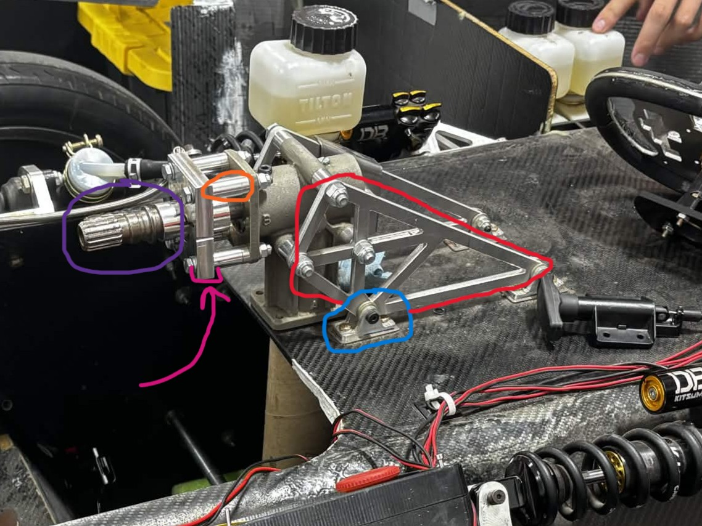

# Manufacturing and Assembly

<figure><figcaption></figcaption></figure>

* <mark style="color:blue;">**Steering Bracket**</mark>
  * CAD: NX
  * CAM: Fusion
  * Manufacturing: Bechtel CNC
  * Note: This part was redone multiple times due the upright section of the matrix snapping in the CNC vice. To avoid this, 3d print a plug at 100% infill to resist the forces of the vice on the uprights.
* <mark style="color:$warning;">**Bearing Block Connectors**</mark>
  * CAD: NX
  * CAM: N/A
  * Manufacturing: Manual Lathe
* <mark style="color:pink;">**Upper Bearing Block**</mark>
  * CAD: NX
  * CAM: Fusion
  * Manufacturing: Bechtel CNC
* <mark style="color:$danger;">**Trusses**</mark>
  * CAD: NX
  * CAM: N/A
  * Manufacturing: Waterjet
  * Notes: For the waterjet, only a 2D DXF was needed to manufacture this part.
* <mark style="color:violet;">**Quick Disconnect**</mark>
  * CAD: NX
  * CAM: Fusion
  * Manufacturing: Bechtel CNC
* Rack Extension
* Rack Extension Stop
* Lower Col Shaft
* Upper to Lower Shaft Coupler
* Chassis Bushing
