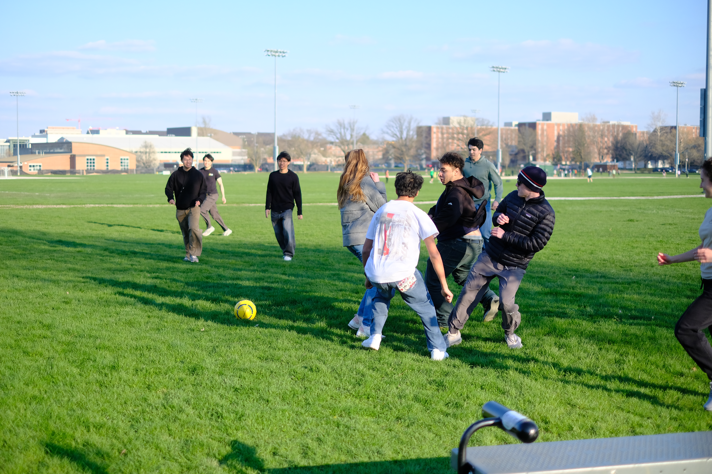

# Solar Racing

## Solar Car

A solar car is a full-sized car, driven by a person inside, that collects energy using its solar array to charge a battery and power a motor.

<figure><figcaption>
it's a solar car !
</figcaption></figure>

Solar car races are usually about endurance more than speed; the winning car travels the furthest distance on just solar energy, meaning the car needs to use that energy very efficiently. Where in regular racecar competitions on closed tracks the idea is to maximize speed through corners, the solar car designer aims to reduce friction wherever possible:

* low rolling resistance tires reduce friction with the ground (although this means solar cars don't fare well with wet pavement)
* a lightweight car helps with rolling resistance as well
* low aerodynamic drag - that big shell that covers the entire car in fact reduces friction from the air, especially at speeds towards 40 mph and higher
  * the reduction of drag combined with the reduced mass of the car means solar cars tend to have problems with stability - there have been cars that have flipped upside down in race history
* very efficient drivetrain and battery
* low resistance wiring and low energy lights and electronics

<figure><figcaption>
catamaran-style solar car
</figcaption></figure>

Additionally, the huge solar array (6 m^2 as of ASC 2026 regulations) means there has to be a large, somewhat flat area of the aero shell pointing up towards the sky. As a result, there are two shapes of top solar car designs: the bullet and the catamaran. The 3-wheeled bullet is what we've been designing and building for the past two cars, and will likely continue to do until we've just about perfected it. The catamaran is named for a style of boats where two bodies are attached by a platform on top, and can have either 3 or 4 wheels. See [Early Artemis Design Notes](https://app.gitbook.com/o/VgqQpOyMtIqpSG170vlO/sites/site_Ly1Ao/s/UuRMvpyeM6qdlkjmzeYV/~/edit/~/changes/182/mechanical/general-info/early-artemis-design-parameters) to know more about why we chose the bullet.

## Team Structure

PSR (Purdue Solar Racing) is made up of 4 subteams: Mechanical, Composites, Electrical, and Operations. Each subteam has 1 or 2 directors that keep their team on the right timelines, onboard new members, and oversee their subsystem leads.

The President serves as the face of the club when interacting with sponsors, other clubs, Purdue departments, and more. They also are meant to be a bridge between Operations and the 3 engineering subteams. The Chief Engineer is in charge of maintaining our CAD and file systems' organization. They make sure that integrations between the 3 engineering subteams are well-communicated.

#### Operations

Operations is in charge of all the non-engineering aspects of running such a large club and going to races. The Treasurer handles the money, of which there is a lot moving around - solar cars are not cheap. PSR has a Marketing Lead, HR Lead, and Logistics Lead that help bring people and sponsors into the club, as well as organize events like the semesterly PSR barbecue and the annual pumpkin carving. Operations also has to organize the logistics of attending the race(s) every year, which is a complicated ordeal of sleeping arrangements and renting cars and making food and more.

<figure><figcaption>
lunch at FSGP 2026
</figcaption></figure> <figure><figcaption>
from sponsorship packet
</figcaption></figure> <figure><figcaption>
BBQ Spring 2025
</figcaption></figure>

#### Composites

Composites handles the parts of the car that are made of composite materials like carbon fiber, as well as other associated parts. The subsystems of structures and aerodynamics concern the monocoque ("single-shell") structural chassis and the aerodynamic shell, which is divided into the boat-like bottom shell and the top shell where the solar cells are integrated. They make ribs that attach the chassis to the inside of the bottom shell, as well as the battery box, wheel covers and light covers, the canopy (windshield bubble over the driver's head), and more.

<figure><figcaption>
bottom shell manufacturing
</figcaption></figure> <figure><figcaption>
chassis with ribs attached
</figcaption></figure> <figure><figcaption>
top shell and canopy
</figcaption></figure>

#### Mechanical

Mechanical is made up of the brakes, dynamics (suspension and steering), hubs, roll cage, and interiors subteams. Brakes stop the car, suspension makes it absorb bumps in the road, steering controls where it goes, hubs attach the wheels to the suspension, the roll cage protects the driver from being hit or the car flipping over, and interiors (-and ergonomics) handles everything else the driver interacts with.

<figure><figcaption>
front suspension
</figcaption></figure> <figure><figcaption>
brakes
</figcaption></figure> <figure><figcaption>
roll cage
</figcaption></figure>

#### Electrical

Electrical has high voltage, low voltage, and strategy. High voltage concerns the battery and drivetrain (motor), where low voltage is in charge of the auxiliary electrical system that has its own smaller battery, lights, horn, screens for the driver, and more. Embedded works on software to communicate between components, and strategy uses data from the systems (telemetry) while driving to figure out optimal driving speed.

<figure><figcaption>
battery pack
</figcaption></figure> <figure><figcaption>
solar charging
</figcaption></figure> <figure><figcaption>
steering wheel controls
</figcaption></figure>

## Races and Timeline

The team usually operates on a two-year design and manufacturing cycle to build each car, with the intent of racing in the annual Formula Sun Grand Prix (FSGP) and the biennial American Solar Challenge (ASC). FSGP is a track race where solar cars from university teams across the nation (and outside the nation!) compete to complete the most laps running only on solar power. ASC is run every other year as a sort of extension to FSGP: a cross-country endurance race, with a different 1000+ mile route across the US every time.&#x20;

In order to participate in ASC, a team must complete a certain number of miles in FSGP. To participate in FSGP, a team must register months in advance, submit vehicle design reports that explain how their car is safe to drive, and pass thorough in-person inspections at the race in a rigorous process called scrutineering. There is a giant rulebook containing every regulation concerning the races and the engineering of the car: [FSGP/ASC Rules 2026](https://www.americansolarchallenge.org/wp-content/uploads/2025/11/ASC2026_Regulations_Revision_B.pdf?fbclid=IwVERFWAOMAXFleHRuA2FlbQIxMQBzcnRjBmFwcF9pZAo2NjI4NTY4Mzc5AAEejN329dcS6PGBL-L3Y_7FzCtyOhxTZRx6-8d5jVdsjMYQVny1xytSjrXy8A4_aem_haTb8-S5qEPHOQt6z29-KA).

We participate in the SOV (single occupant vehicle) division of FSGP/ASC, but there is also MOV (multi occupant vehicle). MOV cars have a driver and at least one other passenger, and are allowed to charge their car using commercial electric vehicle charging stations in addition to solar energy. They are also rated on aesthetics and practicality, with the idea of developing a solar car with more commercial use.

Our design cycle is structured around the school year and the races, which occur in mid-July. A new car is designed to full detail in CAD over the course of one school year, during which there are a few design reviews. Design reviews usually take the form of zoom calls with various experts, race officials, and other guests to whom the team presents the entire car's design (whatever incomplete stage it may be in). These reviews help point out things to change early on, as well as keeping subteams up to date with one another's work.

The following year is roughly allocated for manufacturing as well as assembly and testing. We took our freshly built Artemis to FSGP and ASC 2026 with very little testing, and as a result it is in need of a good number of repairs. So, the two-year design cycle will be offset likely by one year as we refine Artemis for FSGP 2027. We plan to start designing the new car in years 2027-2029, and it will race for the first time in FSGP 2029.fr

## History

\[insert all the super old cars from shell eco marathon where we destroyed high schoolers and then team died with covid and then got revived with apollo lux and artemis]

